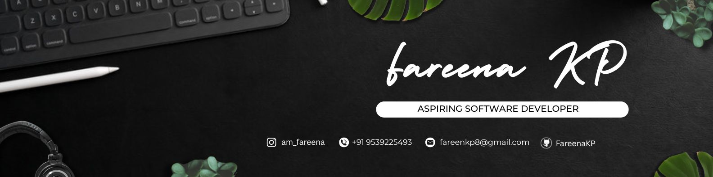

  

<h1 align="center">👋 Hi, I'm Fareena KP</h1>

  <strong>💻 Software Developer | 🐍 Python | 📱 Flutter | ⚡ FastAPI | 🤖 AI</strong>

  
  

---

## 🚀 About Me

💻 I enjoy building practical applications and turning ideas into real-world software.

🐍 Passionate about Python, backend development, APIs, AI, and automation.

📱 Currently exploring Flutter and cross-platform mobile application development.

🤖 Interested in Artificial Intelligence, Machine Learning, and Natural Language Processing.

🌱 Always learning, experimenting, and building new projects.

---

## 🛠️ Tech Stack

### 💻 Languages

### ⚙️ Frameworks & Technologies

### 🗄️ Databases

### 🔧 Tools

---

# 🚀 Featured Projects

### 🎂 NeverMiss

A smart reminder platform that helps users remember birthdays, anniversaries, weddings, achievements, and other important dates by generating personalized wishes and digital postcards.

**Tech:** Flutter • Dart • Python • FastAPI • SQLAlchemy • SQLite

---

### 🤖 AI Resume Screening & HR Analytics

An AI-assisted recruitment platform that uses Natural Language Processing to analyze resumes, extract candidate information, match applicants with job requirements, and rank candidates for HR teams.

**Tech:** Python • Flask • spaCy • NLP • MongoDB • HTML • CSS • JavaScript

---

### 🤖 CodeGPT

An AI-powered coding project designed to explore intelligent programming assistance and the use of AI APIs for developer-focused tasks.

**Tech:** Python • AI • APIs

---

### 🎬 Netflix Clone

A web development project inspired by the Netflix streaming platform, created to practice responsive interfaces, layouts, navigation, and modern web development concepts.

**Tech:** HTML • CSS • JavaScript • Web Development

---

## 🌱 Currently Exploring

🐍 Python & Backend Development
🤖 Artificial Intelligence & Machine Learning
🧠 Natural Language Processing
📱 Flutter & Mobile Development
⚡ REST APIs & FastAPI
🗄️ Database Design
☁️ Cloud & Deployment

---

## 📊 GitHub Stats

  
  

  

---

## 📫 Connect With Me

  

---

  <b>💻 Building ideas into software.</b>
   
  <b>🚀 Learning • Creating • Improving</b>
    
  ⭐ Thanks for visiting my profile!

